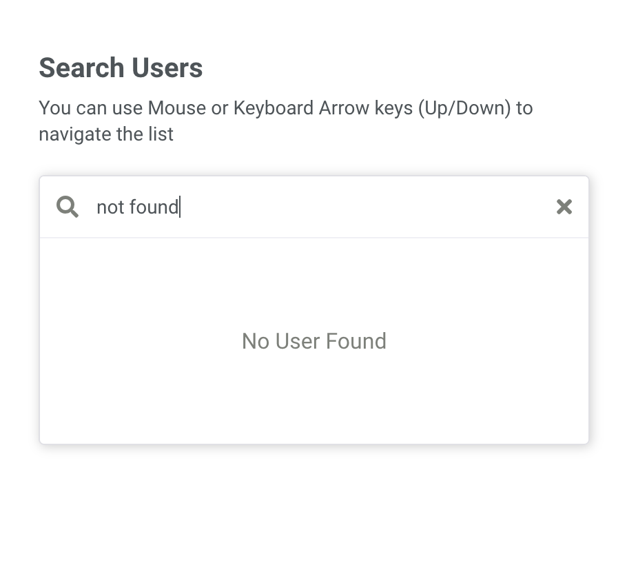

## Search Users
The website let's you search users & navigate the search suggestions using either mouse or keyboard up/down arrow keys.

Experience here: https://pezcoder.github.io/search-users

## Checklist
- [x] UI for Search, Suggestions, No results
- [x] Mouse focus behaviour
- [x] Keyboard navigation of list using up & down arrow keys
- [x] One card should highlight when use both mouse & keyboard
- [x] Focused element to scroll into view
- [] Mouse & keyboard events to play along

## Screenshots
Search Results Found                |  No Search results
:-------------------------:|:-------------------------:
  |  

## Tech stack used
1. Bootstrapped by [Create React App](https://github.com/facebook/create-react-app)
2. Redux, redux-thunk to manage data.
3. SCSS for styling
4. [BEM pattern](http://getbem.com/) for css class names
5. [Redux ducks pattern](https://github.com/erikras/ducks-modular-redux) for redux

## To run locally
Clone the repository & run these:
```
npm install
npm start
```

## Folder Structure & Conventions
```
└─ src
   ├─ components              -- Contains all the individual components
   │  ├─ search-bar
   │  │  ├─ searchBar.scss
   │  │  └─ SearchBar.js
   │  └─ ...
   │     └─ ...
   ├─ redux                   -- All state logic here
   │  ├─ store.js
   │  └─ ducks                -- Follows redux duck pattern: https://github.com/erikras/ducks-modular-redux
   │     └─ search
   │        ├─ search.js.     -- Actions, Creators, Reducer, Selectors for the duck
   │        └─ ...
   ├─ styles
   │  └─ -- All common styles here --
   └─ utilities
      └─ -- All utilities here--
```
